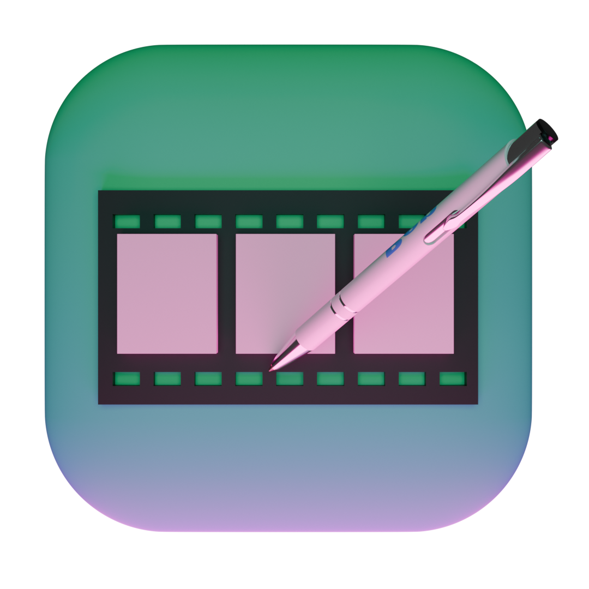
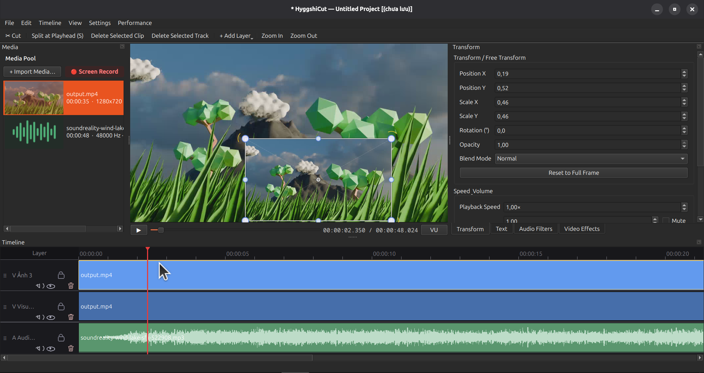

# HyggshiCut

<div id="NexCode-logo" align="center">
    <br />
    
    <h1>HyggshiCut</h1>
    <h3>Free/Libre Open Source Software</h3>
</div>

<div id="badges" align="center">

[](image.png)

**Modern, Lightweight & High-Performance Professional Video Editor for Linux**

[](https://en.wikipedia.org/wiki/C%2B%2B20)
[](https://www.qt.io/)
[](https://ffmpeg.org/)
[](https://www.opengl.org/)
[](https://kernel.org/)
[](https://www.debian.org/)

[](LICENSE)
[](license)
[](license)

[**Features**](#-key-features) •
[**Installation**](#-installation) •
[**Build from Source**](#-building-from-source) •
[**Headless CLI Render**](#-headless-cli-render-guide) •
[**Keyboard Shortcuts**](#-keyboard-shortcuts) •
[**Plugins & Languages**](#-plugin-system--multi-language-support)

</div>

---

## Overview

**HyggshiCut** is an open-source, professional video editor that is ultra-lightweight and highly optimized for Linux. Built on **C++20**, **Qt6**, **FFmpeg (libav\*)**, and an **OpenGL 3.3 Core** rendering backend, HyggshiCut delivers a smooth editing experience with an extremely low RAM footprint.

Beyond its intuitive, modern graphical interface, HyggshiCut also ships with a built-in **Headless CLI Render Engine**, letting you automate batch video exports on a server or in a CI/CD pipeline with no display required.

---

## Key Features

### 1. Multi-Track Timeline & Powerful Editing
- **Flexible multi-layer support:** Unlimited Video, Audio, Image, and Text tracks.
- **Precise cutting tools:** Split at playhead (`S`), trim both ends of a clip, duration stretching, ripple delete, smart snapping.
- **Full history system:** Safe Undo and Redo across every action on the timeline.

### 1b. Explorer & Inspector Panels
- **Explorer (Media Pool):** a thumbnail grid of every imported asset — image, video, and audio — each card showing a preview, media type, and resolution/duration, with a live search box and a proxy-status tag. Single-click a card to inspect it; double-click to preview it; drag it onto the timeline to add it.
- **Inspector (Properties):** one unified right-hand panel with tabbed **Media** (read-only file properties: name, type, location, duration, resolution, frame rate, bitrate, sample rate, channels, file size), **Transform**, **Effects**, **Text**, and **Audio** editors. The panel auto-switches to the relevant tab when you select a clip or a media asset.

### 2. Real-Time GPU Compositing & Effects (OpenGL 3.3 Core)
- **19 Blend Modes:** Normal, Multiply, Screen, Overlay, Add, Subtract, Darken, Lighten, HardLight, SoftLight, Difference, Exclusion, Dodge, Burn, Saturate, HSL Hue/Saturation/Color/Luminosity.
- **Real-time post-processing chain (GPU Shader Pipeline):**
  - Brightness, Contrast, Saturation, Hue Rotate.
  - Multi-pass Gaussian Blur, Sharpen, Vignette, Invert Colors, Sepia.
- **Cinematic 3-Way Color Grading:**
  - Three color wheels: **Lift (Shadows)**, **Gamma (Midtones)**, **Gain (Highlights)**, plus a Luma brightness slider.
  - Built-in color presets: *Teal & Orange*, *Warm Sunset*, *Cool Nordic*, *Vintage 70s*, *Cyberpunk Neon*, *Bleach Bypass*, *Golden Hour*, *Horror Green*.

### 3. Free Transform & Keyframe Animation
- **Free-form frame transforms:** Adjust position $(X, Y)$, scale $(X, Y)$, rotation angle (°), and opacity.
- **Visual Transform Gizmo Overlay:** Drag, rotate, and align directly on the Preview canvas.
- **Smart keyframe system:** Set keyframes on the timeline (shown as diamonds `◆`) to create smooth motion (PIP, zoom, layer slide, fade).

### 4. Smooth Transitions & Fades
- **Transitions between clips:** Click the marker between two adjacent clips on a Visual track to create a transition, then right-click it to choose the type — **Cross Dissolve**, **Wipe**, **Slide**, or **Dip to Color** — along with its direction, duration, and (for dip) the colour it fades through. Transitions render identically in the OpenGL preview, the CPU-fallback preview, and the ffmpeg export.
- **Crossfade transitions:** Smooth cross-dissolve using a RAM-efficient single-pass algorithm.
- **Fade handles:** Drag directly on a clip to create fade-in / fade-out for both video and audio.

### 5. Text & Subtitle Generator
- Create text layers with customizable font, size, alignment, color, bold/italic/underline.
- Support for crisp outline strokes and background boxes with custom color and padding.

### 6. Professional Audio Suite
- **Direct ALSA audio output:** Extremely responsive preview playback with ultra-low latency and no device-drop issues on PipeWire.
- **3-band EQ:** Low (~100Hz), Mid (~1kHz), High (~8kHz).
- **Smart noise reduction:** FFT-based spectral denoising (`afftdn`).
- **Dynamic Range Compressor:** Stable loudness with `acompressor` (Threshold & Ratio).
- **Live stereo VU meter:** Real-time Peak and RMS level metering.

### 7. Optimized Video Export (Low-RAM Exporter)
- **Single-pass algorithm:** Smart filter-complex chaining with no RAM spikes, even on long projects.
- **Wide codec & format support:**
  - Video: `H.264` (libx264), `H.265 / HEVC` (libx265), `VP9` (libvpx-vp9), `AV1` (libsvtav1), `Apple ProRes 422 HQ` (prores_ks).
  - Audio: `AAC`, `MP3` (libmp3lame), `WAV` (PCM 16/24-bit), `Opus`.
  - Container: `MP4`, `MKV`, `MOV`, `WebM`, `MP3`, `WAV`.
- **Built-in export presets:** YouTube 1080p/4K, TikTok / Reels / Shorts 9:16, Instagram 1:1, Low-spec / Ultrafast, Lossless Master.

### 8. Headless CLI Render Mode
- Render video projects directly from a terminal or automated server / CI/CD scripts.
- Includes a render progress bar, ETA estimation, and standard exit codes.

---

## System Requirements & Dependencies

### Minimum requirements:
- **Operating system:** Linux (Ubuntu 22.04+, Debian 12+, Fedora 38+, Arch Linux, etc.)
- **Compiler:** C++20 support (`g++ >= 11` or `clang++ >= 14`)
- **Build system:** `CMake >= 3.20`, `pkg-config`
- **GPU:** OpenGL 3.3 Core Profile or higher

### Installing dependencies on Ubuntu / Debian:

```bash
sudo apt-get update
sudo apt-get install -y \
  build-essential cmake pkg-config dpkg-dev debhelper \
  qt6-base-dev libqt6opengl6-dev \
  libavformat-dev libavcodec-dev libavutil-dev libswscale-dev \
  libswresample-dev libavfilter-dev \
  libmpv-dev libasound2-dev libgl1-mesa-dev
```

### Installing dependencies on Arch Linux:

```bash
sudo pacman -S base-devel cmake qt6-base qt6-declarative \
  ffmpeg mpv alsa-lib mesa
```

---

## Building from Source

```bash
# 1. Clone the repository
git clone https://github.com/Hyggshi-OS-Research-Technology/HyggshiCut.git
cd HyggshiCut

# 2. Create the build directory
mkdir -p build && cd build

# 3. Configure CMake (Release mode)
cmake .. -DCMAKE_BUILD_TYPE=Release

# 4. Build (using all CPU cores)
cmake --build . -j"$(nproc)"

# 5. Launch HyggshiCut
./HyggshiCut
```

### Building with tests enabled:

```bash
cmake .. -DCMAKE_BUILD_TYPE=Debug -DHYGGSHICUT_BUILD_TESTS=ON
cmake --build . -j"$(nproc)"

# Run smoke tests
./HyggshiCutExportSmokeTest
./SegmentBoundTest
./UserProjectExportTest
```

---

## Packaging & Installing the `.deb` Package (Debian / Ubuntu)

You can build a standard Debian `.deb` package yourself:

```bash
# Run from the root of the HyggshiCut repository
dpkg-buildpackage -us -uc -b -j"$(nproc)"

# Install the newly built .deb package
sudo dpkg -i ../hyggshicut_*.deb || sudo apt-get install -f
```

---

## Headless CLI Render Guide

HyggshiCut can render video directly from the terminal without launching the GUI:

```bash
HyggshiCut --render -p <project.hcproj> -o <output.mp4> [options]
```

### CLI parameters:

| Parameter | Short | Description |
|---|---|---|
| `--project <file>` | `-p` | Path to the `.hcproj` project file *(required when rendering)* |
| `--render` | `-r` | Command-line render mode |
| `--no-gui` | | Run without a GUI (automatically enables render mode) |
| `--output <file>` | `-o`, `--ot` | Path to the output video/audio file |
| `--preset <name>` | | Preset name: `youtube-1080p`, `youtube-4k`, `tiktok-9-16`, `instagram-1-1`, `prores`, `audio-mp3`, `audio-wav` |
| `--codec <name>` | | Video codec: `h264`, `hevc` (h265), `vp9`, `av1`, `prores`, `none` |
| `--crf <0-51>` | | Constant Rate Factor (CRF) quality |
| `--bitrate <kbps>` | | Target video bitrate (e.g. `8000k` or `12000`) |
| `--width <px>` | | Output frame width |
| `--height <px>` | | Output frame height |
| `--fps <fps>` | | Frame rate |
| `--progress` | | Show a real-time render progress bar |

### Usage examples:

```bash
# 1. Quick render with the TikTok / Shorts 9:16 preset
HyggshiCut -r -p my_project.hcproj -o shorts_output.mp4 --preset tiktok-9-16 --progress

# 2. Standard 4K 60FPS render with H.265 and CRF 20
HyggshiCut -r -p wedding.hcproj -o wedding_4k.mp4 --codec hevc --crf 20 --width 3840 --height 2160 --fps 60

# 3. Extract audio only, as high-quality MP3
HyggshiCut -r -p podcast.hcproj -o podcast_audio.mp3 --preset audio-mp3
```

---

## Keyboard Shortcuts

| Shortcut | Action |
|---|---|
| `Space` | Play / Pause |
| `S` | Split clip at playhead |
| `Delete` / `Backspace` | Delete the selected clip |
| `Shift + Delete` | Delete the selected layer/track |
| `Ctrl + C` | Copy the selected clip |
| `Ctrl + V` | Paste the copied clip at the playhead |
| `Ctrl + D` | Duplicate the selected clip |
| `,` / `.` | Nudge the selected clip left / right by one frame |
| `←` / `→` | Move back / forward 1 frame |
| `↑` / `↓` | Move back / forward 5 seconds |
| `Home` / `End` | Jump to the start / end of the timeline |
| `Ctrl + Z` | Undo |
| `Ctrl + Y` / `Ctrl + Shift + Z` | Redo |
| `Ctrl + I` | Open the Import Media dialog |
| `Ctrl + T` | Add a new Text layer |
| `Ctrl + E` | Open the Export dialog (video & audio) |
| `Ctrl + Shift + P` | Project frame & Canvas settings |
| `Ctrl + S` | Save project |
| `Ctrl + Shift + S` | Save project as (Save As) |
| `+` / `-` (or `Ctrl + Scroll`) | Zoom In / Zoom Out on the Timeline |
| `Shift + Z` | Fit the whole timeline to the window (Zoom to fit) |
| `Mouse Wheel` | Pan the timeline horizontally (`Shift + Wheel` scrolls vertically) |

> **Ripple delete** (remove a clip and close the gap) is available from the clip's right-click menu and the Edit menu.

---

## Plugin System & Multi-Language Support

### Plugins (`.plhc`)
HyggshiCut supports an extensible color-preset and effects plugin system using `.plhc` files (JSON manifests). It ships with the **Hyggshi Cinematic Color Pack**:
- *Anime Vivid*
- *K-Drama Warm*
- *Lo-Fi Pastel Aesthetic*
- *Matte Black Cinematic*
- *Fuji Film Emulation*
- *Moonlight Blue*
- *Forest Green*

You can manage and load additional custom plugins from `Settings` → `Manage Plugins (.plhc)...`.

### Multi-Language Support (`.langhc`)
The UI supports multiple languages with instant switching — no application restart required:
-  **Vietnamese** (`vi.langhc`)
-  **English** (`en.langhc`)
-  **Japanese** (`ja.langhc`)
-  **Korean** (`ko.langhc`)
-  **Thai** (`th.langhc`)
-  **Simplified Chinese** (`zh.langhc`)

---

## Project Structure

```
HyggshiCut/
├── CMakeLists.txt              # Main CMake build configuration
├── debian/                     # .deb packaging configuration for Linux
├── languages/                  # Language packs (.langhc)
├── plugins/                    # Effects and color preset packs (.plhc)
├── src/
│   ├── main.cpp                # Application entry point & Headless CLI handling
│   ├── audio/                  # Audio filter chain processing (EQ, Denoise, Compressor)
│   ├── cache/                  # Data & render caching
│   ├── core/                   # Core data models: Project, Timeline, Track, Clip, MediaAsset
│   ├── decode/                 # FFmpeg media demuxing & decoding
│   ├── export/                 # RAM-optimized video export engine (Single-pass Exporter)
│   ├── i18n/                   # LanguageManager
│   ├── playback/               # Playback controller & ALSA Direct Audio Output
│   ├── plugin/                 # PluginManager loading and management system
│   ├── render/                 # OpenGL 3.3 Core renderer, TextRenderer, TextureCache
│   └── ui/                     # Qt6 UI (Timeline, Transform, Effects, ColorWheel, ExportDialog...)
└── tests/                      # Feature and export engine test suite
```

---

## License & Authors

- **Author:** Hyggshi OS Foundation / Hyggshi OS Research Technology
- **Contact / Support:** [hyggshidev@gmail.com](mailto:hyggshidev@gmail.com)
- **Homepage:** [https://hyggshi-os-website.pages.dev/](https://hyggshi-os-website.pages.dev/)
- **Source code:** Released under an open-source license.

---

<div align="center">
  <sub>Built with passion for the Linux content-creator community.</sub>
</div>